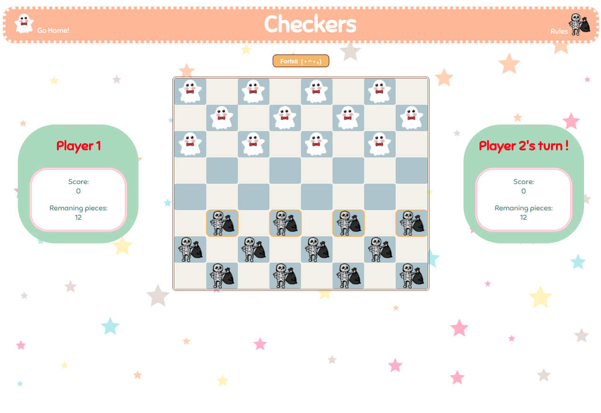

# Checkers

## Date: 17/01/2024

### By: Mariam Mohammad Ali

#### [GitHub](https://github.com/MariamBaloch) | [LinkedIn](https://www.linkedin.com/in/mariam-mohammad-ali-baloch/)

---

### **_Description_**

##### A simple implementation of the classic checkers game using HTML, CSS, and JavaScript. The game is designed for two players and follows the standard rules of checkers.

---

### **_Live Link_**

[Checkers](https://goated-checkers.surge.sh/)

---

### **_Technologies Used_**

- HTML
- CSS
- JavaScript

---

### **_Game Rules_**

#### Setup

##### - The game is played on an 8x8 square board.

##### - Each player starts with 12 pieces distinguished by color.

##### - The pieces are placed on the dark squares of the first three rows on both sides, with 2 middle rows being empty.

#### Starting Player

##### - The start player is decided by rolling a dice

#### Movement

##### - Regular pieces can only move diagonally forward.

##### - King pieces (pieces that have reached the last row on opponent side) can move diagonly forward or backward.

#### Win Condition

##### - A player wins by either capturing all enemy pieces of blocking them in a way they cannot make a move on the board

#### Capturing Pieces

##### - A player can capture (remove) enemy pieces by jumping over it.

##### - If the space the piece landed on allows the player to jump over another piece, they can jump again in the same turn.

---

### **_Trello Board_**

##### A Trello board was used to keep track of development progress and can be viewed [here](https://trello.com/b/dWeCQEiI/checkers-project).

---

### **_Game Screenshots_**

##### Home Page

##### Dice Roll

##### Board

##### Game Rules

---

### **_Credits_**

##### Images for board pieces done by: [RNY](https://github.com/RNY9999)
